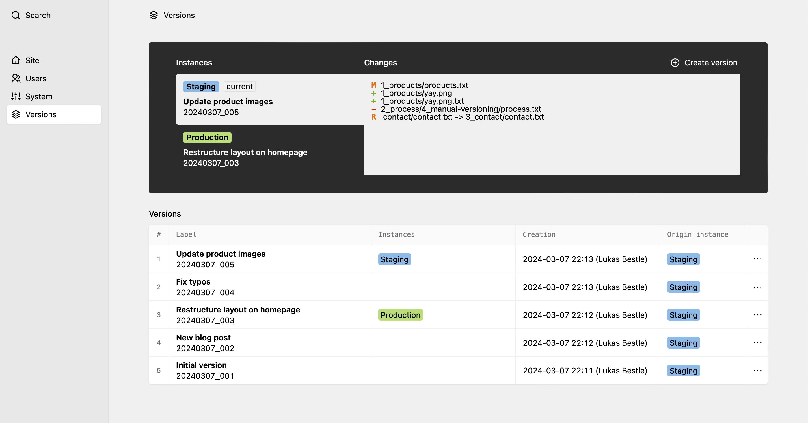

# Versions for Kirby

> Keep track of content changes and switch between different versions from the Kirby Panel

## Support my work

> The Versions plugin is completely free and published under the terms of the MIT license. I do not sell licenses or accept donations, but I'm available for contract work regarding feature development for this plugin.  
> ➯ [Read more…](.github/CONTRIBUTING.md#monetary-support)

## About this plugin

The Versions plugin was built with three use cases in mind:

1. By version controlling the entire contents of your Kirby site, you can go back in time whenever something is changed by accident. You can also find out when the change was made and who made it for which reason.
2. The content and its history should be backed up externally in case the data center burns down or the server is attacked. This backup should always be consistent and atomic so an accurate restore can be guaranteed.
3. In a Kirby site with multiple instances (e.g. staging and production), it should be possible to deploy a new content version to another instance. This deployment should again be consistent.

The [Git version control system](https://git-scm.com) is very well suited for all of these tasks as it is remarkably robust and provides a lot of useful features out of the box that help with all of these goals. This is why the Versions plugin is built on top of Git.

This plugin is made for you if you have one or multiple of the use cases described above. What they have in common is that the content primarily "lives" on the server and is edited from the Kirby Panel. If you instead want to edit the content locally and push it to the server using Git, other plugins will be better suited for your use case.

## Features

- Create and delete content versions directly from the Panel including metadata (time of creation, author, custom label)
- Export versions as ZIP files for local backup
- Switch between the versions on the fly
- Support for multiple site instances (e.g. production and staging) that share their versions and that can be deployed to from a single Panel instance  
  **Note:** This feature currently only works if all sites are hosted on the same server (i.e. if Kirby has access to the file system of all sites).
- Support for fine-grained user permissions

## Requirements

- Kirby 4.0.0+ (version 1.1.0 supports Kirby 3.7.0+)
- PHP 8.1+
- Git 2.5+ (ideally newer for better reliability)

Support for older Kirby versions is provided by previous versions of this plugin. I recommend to update your Kirby installation to benefit from fixes and improvements both in Kirby and in this plugin.

## Documentation

The [plugin documentation](https://github.com/lukasbestle/kirby-versions/wiki) will show you how to set up the plugin initially, how to configure common and advanced features and how to use the plugin.

## License

[The MIT License](LICENSE.md)

## Contributing & Monetary Support

See [`CONTRIBUTING.md`](.github/CONTRIBUTING.md).

## Credits

- Author and developer: [Lukas Bestle](https://lukasbestle.com)
- Idea: [Sascha Lack](https://slstudio.de)
